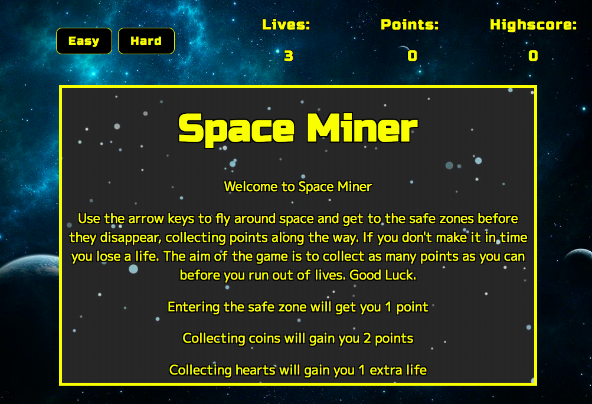

# Game Project: SPACE MINER
### By Bakang Morwaagole

Space Miner is a fun space themed survival game which I made using HTML, CSS, and JavaScript. The aim of the game is to fly around space, rushing to the safe zone while collecting as many points as you can. The game can be played by clicking
 <a href ="https://bakangam97.github.io/SpartaGame.BakangAM97.github.io/"> here </a>.  The repositostry can be cloned and worked on by clicking the button

 

 found on the repository homepage.

## How to Play

When you open the game you'll be presented with this page. Here you will find information on the rules and how to play, as well as buttons to select a gamemode.

When you start the game, you control the astronaut by using the arrow keys to fly around the screen to collect points and get to the safe zone.

## Rules

In easy mode the aim of the game is to survive by getting to the safe area before it disappears. If you don't make it in time you lose a life and when you run out of lives it's Game Over.

* Getting to the safe zone in time will gain you 1 point.

* Collecting a coin gains you 2 points

_Easy Mode_:

* Hearts will spawn allowing you to gain extra lives

* If you manage to obtain 5 lives money bags will spawn instead, gaining you 5 points

_Hard Mode_:

* In hard mode the aim is the same however you won't be able to collect lives

* Money bags will spawn from the start giving you the chance to gain more points.

## Development Process

The first challenge in developing my game was to create smooth character movement. To achieve this I created an array that stored which arrow keys were being pressed down. I then created a function that moved the player based on what keys were being pressed down, which I then called repeatedly with an interval.

The second challenge was to find an efficient way to track the collisions of the player and the items on the board. I solved this by creating a function that could take elements on the page as input and return the value 1 if the player was colliding with it in any way.

## Future Developments

In the future I aim to make my game playable on mobile devices, using touch screen controls to move the player around.
